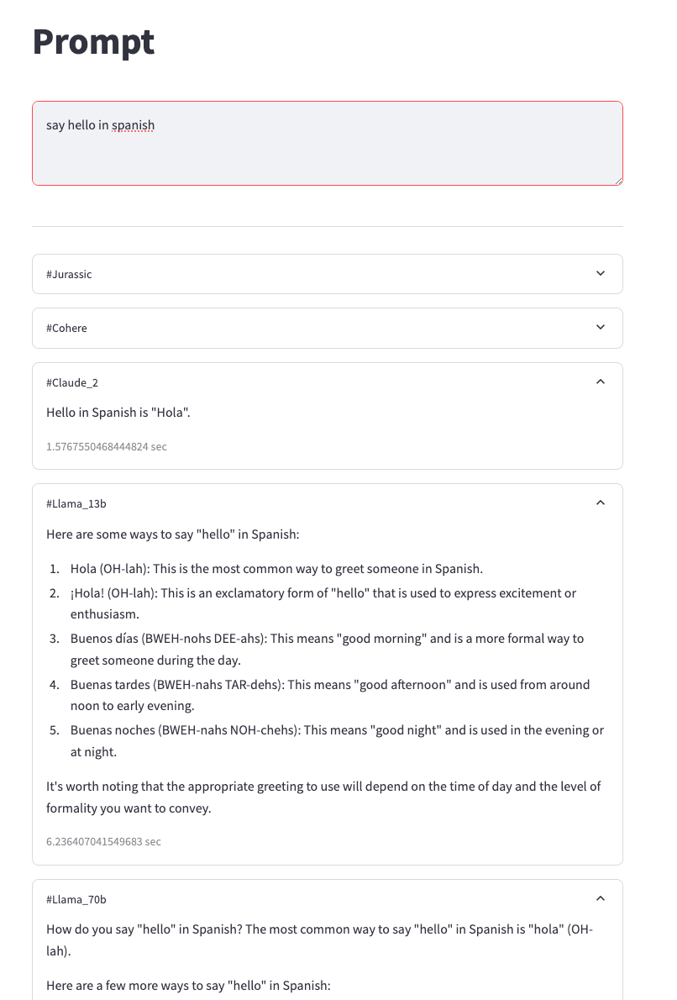

# Objective

1. To explore the results from different model

# Features

1. Multi-processing
2. Results from multiple models (cohere, jurassic, claude2, llama13b, llama70b)
3. Response time in seconds

# To be added

1. Cost calculation per request for each model
2. Additional model(mistral, sonnet, haiku)
3. Configuration to select which model

# Getting started

1. `pip install -r requirements.txt`
2. `streamlit run your_script.py run-foundational-models.py`

# Screenshots

