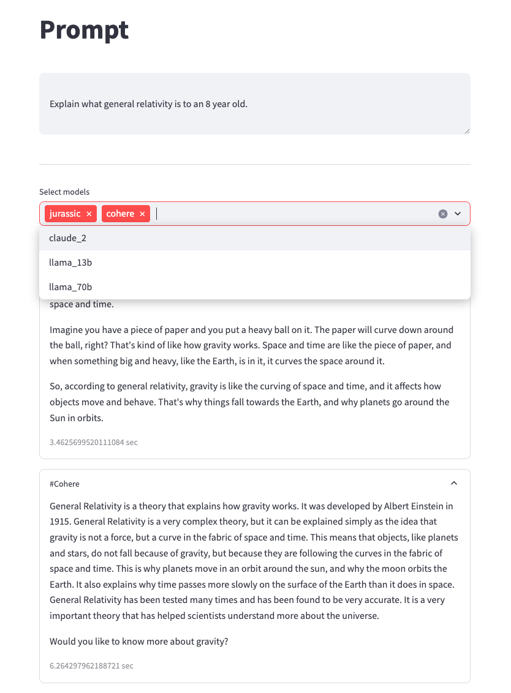

# Objective

1. To explore the results from different model

# Features

1. Multi-processing
2. Results from multiple models 
3. Response time in seconds
4. Configuration to select which model

# To be added

1. Cost calculation per request for each model
2. Add more models

# Models available

- [x] cohere
- [x] jurassic
- [x] claude_v2
- [x] llama13b
- [x] llama70b
- [x] titanText
- [ ] mistral
- [ ] claude sonnet
- [ ] claude haiku

# Getting started

```
> pip install -r requirements.txt
> cp .env.sample .env # Update values inside
> source .env
> streamlit run your_script.py run-foundational-models.py

```


# Screenshots

